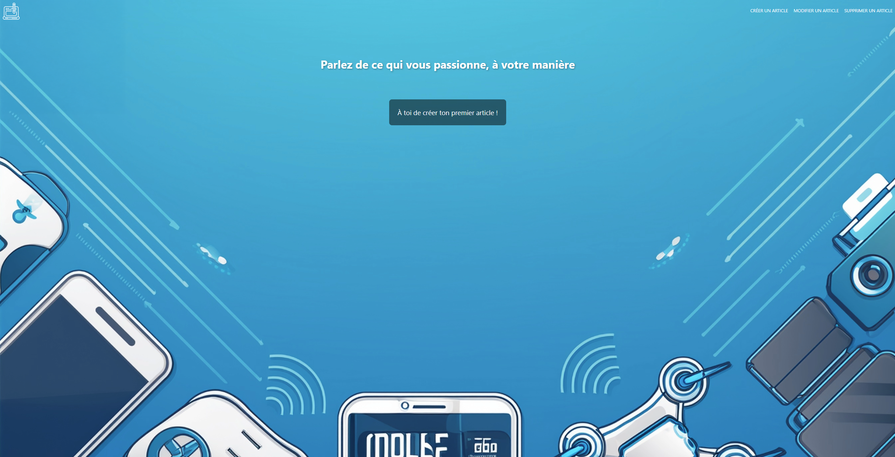

# Lightweight NodeJS/Express/Javascript Blog

[]()

FRENCH VERSION - A lightweight, fast, and responsive blog developed with NodeJS, Express, and Javascript. Allows you to create, modify, and delete articles easily.

## ✨ Features

- **Article Creation:** Intuitive interface for writing and publishing new articles.
- **Article Modification:** Ability to update and modify existing articles.
- **Article Deletion:** Easy deletion of obsolete or irrelevant articles.
- **Responsive Design:** Adapted to all types of screens (computers, tablets, smartphones).
- **Backend NodeJS/Express:** RESTful API for efficient data management.
- **Frontend Javascript:** Dynamic and reactive user interface.

## 🛠️ Technologies Used

- **Backend:**
  - NodeJS
  - Express
  - EJS
- **Frontend:**
  - Javascript
  - HTML
  - CSS
- **Other:**
  - npm for dependency management
  - Git for version control

## Installation

1.  **Clone the repository:**

    ```bash
    git clone https://github.com/Antoinekoe/blog.git
    cd [project_directory_name]
    ```

2.  **Install the dependencies:**

    ```bash
    npm install
    ```

3.  **Start the server:**
    ```bash
    nodemon index.js
    ```
    The blog will be accessible at `http://localhost:[PORT]` (replace `[PORT]` with the port configured in index.js or the default, usually 3000).

## 🗂️ Project Structure

```
Blog/
├── node_modules/ # Directory containing npm dependencies (not explicitly listed)
├── public/ # Directory containing static files (CSS, JS, images)
│   ├── images/ # Directory for images
│   │   ├── bg-2.png
│   │   ├── bg.png
│   │   ├── blog.svg
│   │   └── screenshot-blog.PNG
│   └── styles.css # CSS file (global, if used)
├── views/ # Directory containing views (EJS templates)
│   ├── Articles/ # Directory for article views
│   │   ├── create.ejs # View for creating an article
│   │   ├── delete.ejs # View for deleting an article
│   │   ├── index.ejs # View for the article list
│   │   └── modify.ejs # View for modifying an article
│   ├── partials/ # Directory for reusable view parts
│   │   ├── footer.ejs # Footer
│   │   └── header.ejs # Header
│   └── templateArticle.js # Javascript template file for an article
├── .gitignore # File specifying files and folders to ignore by Git
├── index.js # Application entry point (Express server, or other)
├── package-lock.json # npm dependency lock file
├── package.json # npm configuration file
└── README.md # This file
```

## 🤝 How to Contribute

Contributions are welcome! If you wish to contribute to the project, please follow these steps:

1.  **Fork the repository.**
2.  **Create a branch for your feature or bugfix:**

    ```bash
    git checkout -b feature/my-new-feature
    # or
    git checkout -b bugfix/bug-fix
    ```

3.  **Make your changes and commit them with clear and descriptive messages.**

4.  **Push your branch to your fork:**

    ```bash
    git push origin feature/my-new-feature
    ```

5.  **Create a pull request (PR) to the `main` branch of the original repository.**

## 🔧 Potential Improvements (TODO)

- Add the ability to categorize articles.
- Implement an authentication system for article management (currently, anyone can create, modify, delete).
- Optimize performance (e.g., with caching).
- Add unit and integration tests.
- Implement a commenting system.
- Connect the blog to a database.

## 🔑 License

This project is licensed under the MIT License - see the [LICENSE](LICENSE) file for details.
